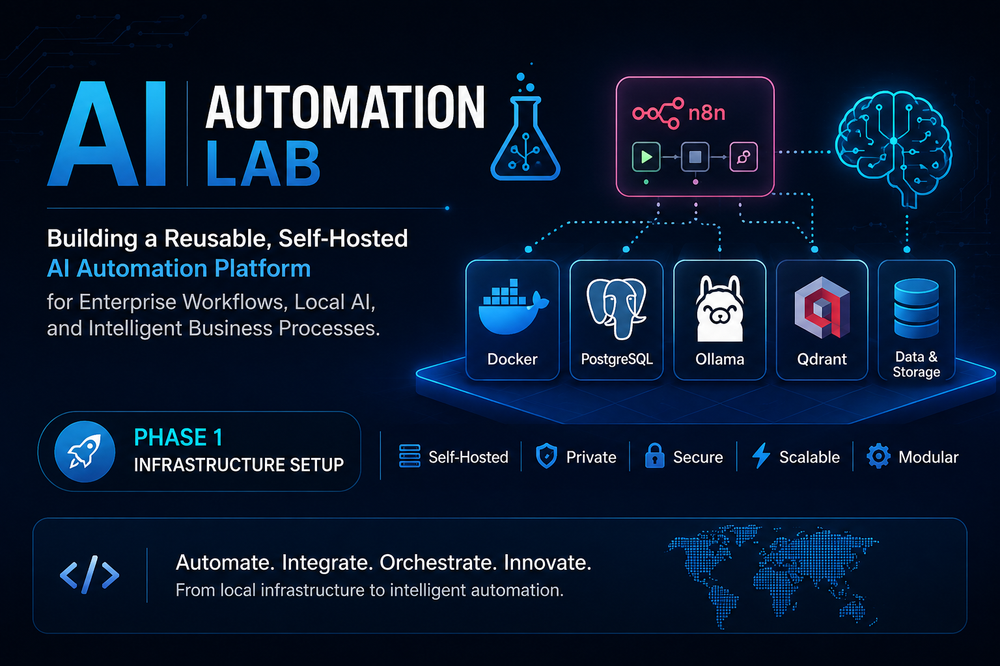

<p align="center">
  
</p>

# 🤖 AI Automation Lab

> **Building a reusable, self-hosted AI Automation Platform for Enterprise Workflows, Local AI, and Intelligent Business Process Automation.**

---

## 🚀 About This Project

Welcome to **AI Automation Lab**.

This repository documents my hands-on journey of designing and building a reusable AI Automation Platform from the ground up.

After spending over **15 years** improving business operations, customer service, fraud controls, process management, and enterprise workflows within the banking industry—and more recently expanding into **SAP Business Transformation, Process Mining, and Low-Code Automation**—I decided to go beyond using AI tools and learn how modern AI automation platforms are actually built.

Rather than creating isolated AI demonstrations, my goal is to build a modular platform that can support multiple enterprise AI solutions from a single infrastructure.

This project is therefore both:

- 📖 A technical learning journey
- 💼 A professional portfolio project
- 🚀 A reusable AI platform for future automation solutions

---

# 🎯 Project Vision

The long-term objective is to build a reusable AI platform capable of supporting:

- AI Agents
- Local Large Language Models (LLMs)
- Enterprise Workflow Automation
- SAP Automation
- Process Mining
- Gmail Automation
- CRM Automation
- LinkedIn Automation
- Document Intelligence
- Retrieval-Augmented Generation (RAG)
- Knowledge Management
- Intelligent Business Process Automation

---

# 🏗 Platform Architecture (Phase 1)

```
                   Windows 11
                        │
                        ▼
                 Docker Desktop
                        │
                        ▼
                 Docker Compose
                        │
          ┌─────────────┴─────────────┐
          │                           │
          ▼                           ▼
     PostgreSQL                    n8n
(Database & Storage)        (Automation Engine)
```

This architecture provides a stable and scalable foundation for future AI services.

---

# ✅ Phase 1 — Foundation Complete

The first milestone focused on building the core infrastructure.

## Technologies Used

- Docker Desktop
- Docker Compose
- PostgreSQL
- n8n
- Windows 11 Pro
- PowerShell

---

# 📚 Skills Demonstrated

Throughout this phase I gained practical experience in:

- Docker Containerization
- Docker Compose
- PostgreSQL Deployment
- Environment Variables
- Persistent Docker Volumes
- Container Networking
- Infrastructure Troubleshooting
- Self-Hosted Applications
- YAML Configuration
- AI Infrastructure Fundamentals

---

# 🎯 Project Deliverables

During Phase 1 I successfully:

- Installed Docker Desktop
- Configured Docker Resources
- Built a Docker Compose environment
- Deployed PostgreSQL
- Deployed n8n
- Configured persistent storage
- Created Docker volumes
- Created Docker networking
- Connected n8n to PostgreSQL
- Successfully launched the automation platform

---

# 📸 Project Screenshots

The repository includes screenshots documenting the complete deployment process.

Examples include:

- Development Environment
- Docker Desktop Configuration
- Docker Hello World
- Project Folder Structure
- Docker Compose Deployment
- Running Containers
- Docker Desktop Dashboard
- n8n Owner Setup
- n8n Dashboard
- Runtime Resource Usage

---

# 💡 Key Lessons Learned

This phase reinforced several important engineering concepts.

### Infrastructure Matters

Before building AI applications, it's important to understand the infrastructure that powers them.

### Containerization Simplifies Deployment

Docker makes applications portable, isolated, and easier to maintain.

### Persistent Storage is Critical

Using PostgreSQL instead of SQLite provides a stronger foundation for production-style automation.

### Automation Starts with Good Architecture

Building reusable infrastructure allows future projects to focus on business value rather than repeatedly installing software.

---

# 🛣 Project Roadmap

| Phase | Status |
|---------|---------|
| ✅ Phase 1 | Docker + PostgreSQL + n8n |
| ⏳ Phase 2 | Ollama (Local AI Models) |
| ⏳ Phase 3 | Qdrant Vector Database |
| ⏳ Phase 4 | Open WebUI |
| ⏳ Phase 5 | Retrieval-Augmented Generation (RAG) |
| ⏳ Phase 6 | AI Agents |
| ⏳ Phase 7 | Enterprise AI Automation Solutions |

---

# 🎯 Why This Project Matters

My objective is not simply to learn AI tools.

It is to understand how enterprise-grade AI automation platforms are designed, deployed, documented, and maintained.

By building the platform incrementally, every phase becomes a practical demonstration of new skills that can be applied to real-world business automation projects.

---

---

## ✅ Phase 2 – Local AI Models

In this phase, I added local AI capability to the platform using Ollama.

### Completed

- Installed Ollama on Windows
- Verified Ollama version `0.32.5`
- Downloaded the Llama 3.2 local language model
- Successfully ran the model from PowerShell
- Tested local AI inference without using an external API

### Result

The platform can now run a local large language model directly on the computer, creating the foundation for AI-powered n8n workflows.

**Status:** Completed
# 🚀 What's Next?

The next phase will introduce:

- Ollama
- Local AI Models
- AI Workflow Integration
- Local Prompt Engineering
- AI-powered Automation with n8n

---

# 👤 About Me

I am a Business Process and Digital Transformation professional with experience in:

- Business Process Management
- Banking Operations
- Fraud & Financial Crime Operations
- SAP Signavio
- SAP Build
- Process Mining
- CRM Automation
- Low-Code Development
- Data Analytics
- Enterprise Automation

This repository documents my continuous transition into AI Automation Engineering while combining my existing business process expertise with modern AI technologies.

---

## ⭐ Follow the Journey

This repository will continue to grow as new services and enterprise AI capabilities are added.

If you're interested in AI Automation, Enterprise Architecture, SAP, or Business Process Transformation, feel free to follow the project.

---

**Thank you for visiting AI Automation Lab.**
